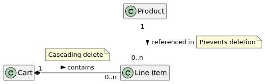

# Depot Application

with Ruby on Rails 7

## Configuration

* Ruby 3.1.0p0
* RubyMine 2022.1 EAP
* SQLite 3.36.0
* Rails 7.0.2.2
* RubyGems 3.3.3
* Rack 2.2.3

## Models


```
@startuml
class Product
hide members

Product "1" -- "0..n" "Line Item" : referenced in >
note right on link: Prevents deletion

Cart "1" *- "0..n" "Line Item" : contains >
note top on link: Cascading delete

@enduml
```

## Setup

```
rails new depot --css tailwind

cd depot
bin/rails about
bin/rails generate scaffold Product title:string description:text image_url:string price:decimal
bin/rails generate controller Store index
bin/rails generate scaffold Cart
      create    db/migrate/20220311230729_create_carts.rb
      create    app/models/cart.rb
      create    test/models/cart_test.rb
      create    test/fixtures/carts.yml
       route    resources :carts
      create    app/controllers/carts_controller.rb
      create    app/views/carts
      create    app/views/carts/index.html.erb
      create    app/views/carts/edit.html.erb
      create    app/views/carts/show.html.erb
      create    app/views/carts/new.html.erb
      create    app/views/carts/_form.html.erb
      create    app/views/carts/_cart.html.erb
      create    test/controllers/carts_controller_test.rb
      create    test/system/carts_test.rb
      create    app/helpers/carts_helper.rb
bin/rails generate scaffold LineItem product:references cart:belongs_to      
bin/rails db:migrate

bin/dev
bin/rails dev:cache

bin/rails generate migration add_quantity_to_line_items quantity:integer
bin/rails db:migrate

bin/rails generate migration combine_items_in_cart
bin/rails db:migrate
bin/dev
bin/rails db:rollback
bin/rails db:migrate:status
```

## Database
```
bin/rails db:migrate
bin/rails db:seed
bin/rails dbconsole

bin/rails db:rollback
bin/rails db:migrate
bin/rails db:seed

bin/rails db:migrate:status
```

## Testing

```
bin/rails test
bin/rails test:models
bin/rails test:controllers

cat test/fixtures/products.yml
rm db/test.sqlite3
bin/rails db:test:prepare
ls -ls db/test.sqlite3
```

### Git
```
git add .
git commit -m "Fully configured"
git checkout .
```

## Books & Bookmarks

* [assert_select](https://apidock.com/rails/ActionController/Assertions/SelectorAssertions/assert_select)
* [PlantUML Class Diagram](https://plantuml.com/de/class-diagram)
* [Rails 7.0 ActiveSupport::Testing::Assertions](https://api.rubyonrails.org/classes/ActiveSupport/Testing/Assertions.html)
* [Docker for Rails Developers](https://pragprog.com/titles/ridocker/docker-for-rails-developers/)

